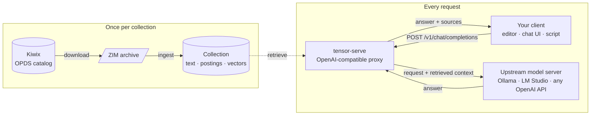
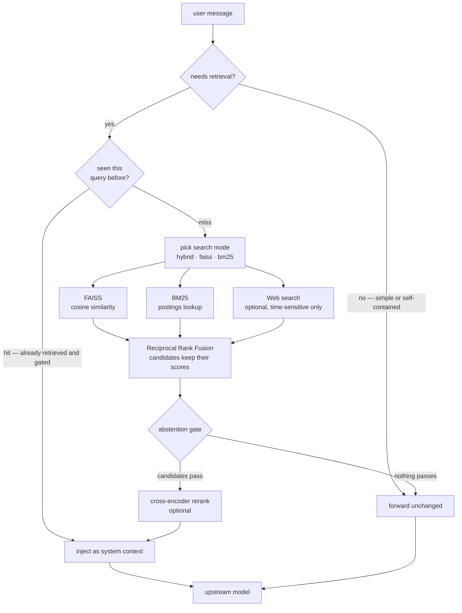
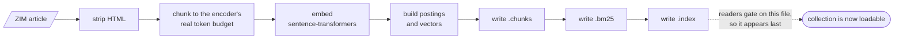
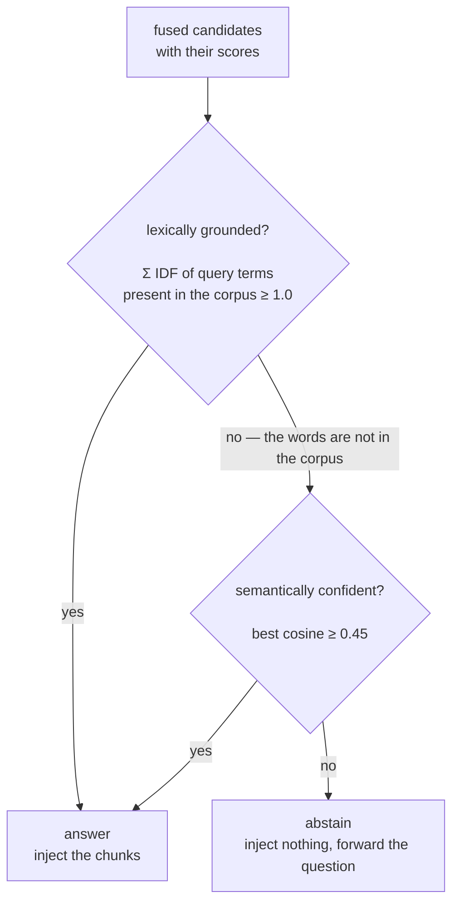

#  Tensor (Serve)

`tensor-serve` is a ZIM-based retrieval augmented proxy for any OpenAI-compatible AI. This program lets you download ZIM documentation from the **live Kiwix OPDS catalog**, builds a local semantic vector database from it, and uses that database to provide an AI model relevant context when answering questions.

The purpose of this program is to provide the service for customizing your AI for your specific needs seamlessly.

Combining `keyword search` and `semantic search`, Tensor helps produce more accurate responses for the data you have included in a ZIM database.



Your client talks to `tensor-serve` exactly as it would talk to the model directly. Tensor
retrieves what is relevant from your own archives, injects it, and forwards the request —
so any tool that speaks the OpenAI API gains your documentation without knowing Tensor exists.

---

## 1. How the AI pipeline works

1. **Download** — ZIM files fetched from Kiwix and stored in the configured ZIM source folder (`zim_files/` by default)
2. **Ingest** — Articles extracted, HTML stripped, split into overlapping chunks sized to the embedding model's real token limit, embedded with `sentence-transformers`, indexed in FAISS **and** BM25
3. **Auto-load** — On server startup, the last active collection's FAISS and BM25 indexes are loaded automatically
4. **Analyze** — Simple queries can skip retrieval; domain-specific queries use the query analyzer to choose the best search mode (`hybrid`, `faiss`, or `bm25`); time-sensitive queries optionally trigger web search
5. **OpenAI-compatible proxy** — For `/v1/chat/completions`, the user message is embedded (or served from cache) → hybrid search retrieves top-k scored chunks (optionally merged with web results) → the abstention gate decides whether the corpus can answer at all → optional cross-encoder reranking improves result order → retrieved context is injected into the request before it is forwarded to the upstream AI server. When the gate does not pass, the request is forwarded with **no** injected context.

### The query path



The three retrievers run against the same chunk numbering, so fusion compares like with like,
and every candidate carries its own index and score the whole way through — which is what
makes both the gate and source attribution possible.

### Hybrid search (FAISS + BM25 + optional Web Search w/ Reciprocal Rank Fusion)

Search requests and OpenAI-compatible chat requests can run **up to three retrievals in parallel** and merge them:

| | FAISS (semantic) | BM25 (keyword) | Web Search |
|---|---|---|---|
| Finds | Conceptually related chunks | Exact term / token matches | Current / recent information |
| Good for | *"How does backpressure work?"* | *"asyncio.gather"*, error codes, API names | *"latest news"*, *"today's events"*, time-sensitive queries |
| Requires setup | Automatic | Automatic | Optional; disabled by default |

Results are merged with **Reciprocal Rank Fusion** (`score = Σ 1 / (60 + rank)`). Chunks that rank well in multiple result sets float to the top. The pipeline degrades gracefully — if one index is unavailable it is skipped.

### Index layout and performance

Keyword scoring walks an inverted index, so a query touches only the chunks containing one
of its terms rather than the whole collection. Measured on a synthetic corpus of 500-word
chunks:

```
BM25 query latency, synthetic corpus of 500-word chunks — lower is better

  before   20,000 chunks  ██████████▊                                      25.79 ms
  after    20,000 chunks  ▏                                                 0.22 ms

  before   80,000 chunks  ████████████████████████████████████████████    104.86 ms
  after    80,000 chunks  ▍                                                 0.85 ms
```

On 10,399 chunks of real documentation, where the time goes per query:

```
  embed    before ██████▉                               4.16 ms
           after  ███████▌                              4.50 ms

  BM25     before ████████████████████████████████▊    19.75 ms
           after  ▍                                     0.24 ms

  FAISS    before ▍                                     0.24 ms
           after  ▍                                     0.23 ms

  fuse     before ██████████████████████████████████    20.50 ms
           after  ▊                                     0.51 ms
```

Retrieval now costs less than embedding the query, which is the irreducible part. Query p50
over the whole pipeline went 13.3ms to 5.4ms. Building the index is slower in exchange (22.7s at 80,000 chunks), a
one-time cost traded against every query.

Ingest is dominated by embedding, not by I/O or indexing — on 497 articles the split is
read 0.1%, chunk 11.2%, **embed 86.6%**, index 2.0%. Parallelising the ZIM walk across
processes is therefore capped at about 11% and would contend for the cores the encoder is
already using; the throughput ceiling is the embedding model itself, at ~340 chunks/s here.

A collection is three files, and the chunk text is stored once:

```
<name>.chunks              chunk text and metadata, shared by both indexes
<name>.bm25                postings, document lengths and IDF
<name>.faiss_flat.index    vectors — written last, and what readers gate on
```

Ingestion, and the order the files land in:



Each file is written to a temporary path and moved into place, so a server querying the
collection during a rebuild sees either the old index or the new one — never half of either.

Both indexes read `<name>.chunks` through a process-wide cache, so the corpus is held once
in memory as well as once on disk — 39.4MB total for the 10,399-chunk corpus, down from 51.0MB.

### Durability

Index files are written to a temporary file and then moved into place, so a reader sees
either the old index or the new one, never half of either. Writing in place instead —
which truncates the destination before refilling it — produced **34,704 torn reads out of
34,709** in a few seconds of concurrent access; after the change, 0. A server answering
queries while an ingest runs sits squarely in that window.

The chunk store is written before the vector index, because `index_exists` gates on the
vector index: a crash part-way leaves a store with no index beside it, which reads as
"not built", rather than an index promising chunks that were never written.

An ingest holds an advisory lock on the collection, so two builds refuse to interleave
rather than producing a vector index and a keyword index that disagree about what chunk 7
is. A lock left behind by a process that died is detected and broken, so a crash needs no
manual cleanup.

No index file contains a pickle. An index is derived from a ZIM someone downloaded, and
`pickle.load` on such a file executes whatever it contains; chunk text is stored as a UTF-8
blob plus an offsets array, postings as flat numpy arrays, metadata as JSON, all read with
`allow_pickle=False`.

**On merging collections.** `run_multi_ingest` merges every ZIM into one database. Measured
on real corpora — 153 chunks of this project's documentation, alone and then merged into
10,399 chunks of Python documentation — the merge costs the smaller corpus **2.5% recall@5
and 1.7% precision@1**. Worth knowing, not worth one index per collection.

### Abstention — knowing when not to answer

Retrieval returns scored candidates, not bare text, so the pipeline can tell the difference
between *"here is the answer"* and *"this corpus cannot answer that"*.



Either tier alone is enough. Requiring both would reject exactly the questions embeddings were
added for — a question whose answer shares no vocabulary with it — while requiring neither is
how the pipeline came to answer invented words with confident documentation.

Measured on 10,399 chunks of Python documentation, over questions whose correct answer is
known by construction:

| | top cosine (min / p10 / median) | summed IDF evidence (min / median) |
|---|---|---|
| real questions | 0.201 / 0.399 / 0.610 | 2.27 / 18.42 |
| nonsense | 0.308 / 0.313 / 0.331 | 0.00 / 0.00 |

Evidence separates the two cleanly, because gibberish shares no vocabulary with the corpus.
Cosine does not — nonsense reaches 0.381 while a real question sits at 0.201 — so an absolute
cosine floor alone would reject real questions in order to reject gibberish. Hence evidence
first, cosine as a second chance.

Turning the gate on moved abstention on nonsense from **0% to 100%** with recall@k, precision@1
and MRR unchanged. Verify it on your own corpus with `tensor-serve eval`.

Tune with `abstention_enabled`, `lexical_evidence_floor` and `semantic_confidence_floor`.
Web search results bypass the gate, since they answer what the local corpus cannot.

The query analyzer automatically selects the search strategy:

| Mode | When it is used |
|---|---|
| `hybrid` | Mixed or general queries where semantic and keyword signals both help |
| `faiss` | Conceptual queries such as explanations, architecture, patterns, and design questions |
| `bm25` | Keyword-heavy queries such as API names, code symbols, methods, classes, errors, and short exact searches |

Query embeddings and search results are cached with an in-memory LRU cache to reduce repeated embedding and retrieval work. If enabled, the optional cross-encoder reranker performs a second-stage pass over retrieved chunks before context is sent to the model.

---

## 2. Search Complexity Profiles

Tensor Serve supports **configurable search complexity tiers** allowing you to optimize for your specific deployment:

| Profile | Search Algorithms | Use Case | Latency | Memory |
|---------|-------------------|----------|---------|--------|
| **Lightweight** | BM25 Okapi + FAISS Flat | Local machines, embedded | <20ms | <500MB |
| **Balanced** (default) | BM25 Okapi + FAISS Flat + Reranking | General purpose servers | 50-100ms | 1-2GB |
| **Production** | BM25+ + FAISS-IVF + Query Expansion + Advanced Reranking | Enterprise servers, large scale | 200-500ms | 4-8GB |
| **Manual** | Custom backend selection | Fine-tuned deployments | Varies | Varies |

### Quick Start: Switching Profiles

**Use a preset profile:**
```bash
tensor-serve config set-search-profile lightweight
tensor-serve config set-search-profile production
```

**Fine-tune with overrides:**
```bash
tensor-serve config set-search-profile balanced \
  --query-expansion prf \
  --enable-reranker
```

**Manual profile (full control):**
```bash
tensor-serve config set-search-profile manual \
  --keyword-backend bm25_plus \
  --semantic-backend faiss_ivf \
  --query-expansion prf \
  --enable-reranker \
  --reranker-model balanced
```

REST endpoints remain available for automation and custom integrations, for example
`POST /config/search-profiles/production`.

### Available Backends

**Keyword Search:**
- `bm25_okapi` - Standard BM25, fast baseline
- `bm25_plus` - Enhanced BM25 with better precision

**Semantic Search:**
- `faiss_flat` - Exact L2 distance search (good for <500K vectors)
- `faiss_ivf` - Approximate search with clustering (optimal for 500K+ vectors)

### Query Expansion (Optional)

Dynamically expands queries to improve recall:
- `none` - No expansion (default, fastest)
- `prf` - Pseudo-relevance feedback (expand with top-1 result terms)
- `entity` - Entity extraction and weighting

### Reranker Models

Fine-tune quality vs. latency trade-off:
- `lightweight` - 22M params, ~50ms per batch (default)
- `balanced` - 71M params, ~100ms per batch (recommended for production)

Detailed information about the RAG proxy implementation can be found [here](api/README.md).

---

## 3. CLI Reference

[CLI Reference](cli/README.md) can be found here. It covers ZIM downloads, configuration, health, cache, cleanup, ingestion, vector databases, and collections.

---

## 5. REST API (`api/main.py`)

[API Reference](api/README.md) can be found here. Contains `Health & Configuration`, `Cache`, `Collections`, `ZIM File Management`, `Vector Database`, `Download progress fields`, `Cleanup`, `OpenAI-Compatible API`, `Settings`, `Web Search for Time-Sensitive Information`, `Search Mode Customization`, `Model auto-detection`.

---

### Using With OpenAI-compatible Tools (Code Editors, etc..)

**Point any OpenAI-compatible tool at `http://localhost:8000/v1`** (or `http://localhost:8000` for tools that auto-discover models):

| Tool | Configuration |
|---|---|
| **Zed** | Settings: `assistant.openai_api_url` = `http://localhost:8000` |
| **Cursor** | Settings → Models → OpenAI Base URL = `http://localhost:8000` |
| **Continue (VS Code)** | `~/.continue/config.json` → `models` → `apiBase` = `http://localhost:8000/v1` |
| **Aider** | `--openai-api-base http://localhost:8000/v1` |
| **Open WebUI** | Admin → Connections → OpenAI API → Base URL = `http://localhost:8000/v1` |
| **OpenAI SDKs** | `client = OpenAI(base_url="http://localhost:8000/v1")` |

---

## Setup

### Prerequisites

- **Python 3.10+** (check with `python3 --version`)
- **pip** (Python package manager, usually bundled with Python)
- **An OpenAI-compatible AI endpoint** (examples: Ollama, LM Studio, OpenAI API, Anthropic, LiteLLM gateway) — optional for basic setup, required for chat functionality

### Setup Example

**1. Install via pip:**

```bash
pip install tensor-serve
```

**2. Create and activate a virtual environment (optional but recommended):**

```bash
python3 -m venv .venv
source .venv/bin/activate  # On Windows: .venv\Scripts\activate
pip install tensor-serve
```

**3. Configure the upstream OpenAI-compatible AI endpoint:**

```bash
tensor-serve config detect-local-ai
tensor-serve config set-ai-endpoint \
  --endpoint http://localhost:11434 \
  --model mistral
```

Optional: inspect models exposed by the configured endpoint:

```bash
tensor-serve config list-models
```

**4. Choose where ZIM files are stored:**

```bash
tensor-serve config set-zim-source ./zim_files
```

**5. Browse and download ZIM content from Kiwix:**

```bash
tensor-serve zim list
tensor-serve zim install wikivoyage_en_europe
```

Optional: use an interactive category downloader instead:

```bash
tensor-serve zim install-category coding
```

**6. Review the saved configuration and installed ZIM files:**

```bash
tensor-serve config show
tensor-serve zim status
```

**7. Start the server:**

```bash
tensor-serve start
```

Other start options:

```bash
tensor-serve start --port 3000              # Custom port
tensor-serve start --auto-port              # Auto-select available port if 8000 is in use
tensor-serve start --reload                 # Development mode with auto-reload
```

> **Note:** If you prefer to install from source (development), clone the repository and install in editable mode:
> ```bash
> git clone https://github.com/3M1RY33T/tensor-serve.git
> cd tensor-serve
> python3 -m venv .venv
> source .venv/bin/activate
> pip install -r requirements.txt
> pip install -e .
> ```

For cloud or gateway providers, include an API key and provider-specific endpoint:

```bash
tensor-serve config set-ai-endpoint \
  --endpoint https://api.openai.com/v1 \
  --model gpt-4o-mini \
  --api-key "$OPENAI_API_KEY"
```

API keys are encrypted before they are written to `config.json`. Tensor Serve uses a local `.tensor_config.key` file by default, or you can provide `TENSOR_CONFIG_KEY` / `TENSOR_CONFIG_KEY_FILE` for deployments that manage secrets externally.

### Docker

Build and run locally:

```bash
docker build -t tensor-serve:local .
docker run --rm -p 8000:8000 -v tensor_serve_data:/data tensor-serve:local
```

Or use Compose:

```bash
docker compose up --build
```

The container stores runtime state in `/data`, including `config.json`, encrypted
config key material, ZIM files, collections, and generated vector databases.
When connecting to a host machine AI runtime from Docker Desktop, use the host
gateway address:

```bash
docker compose exec tensor-serve tensor-serve config set-ai-endpoint \
  --endpoint http://host.docker.internal:11434 \
  --model mistral
```

### Supported Environments

**Local AI Runtimes** (no API key needed):
- [Ollama](https://ollama.ai) — easy single-command setup
- [LM Studio](https://lmstudio.ai/) — GUI-based model management
- [vLLM](https://github.com/vllm-project/vllm) — high-performance serving

**Cloud APIs** (API key required):
- OpenAI (`https://api.openai.com/v1`)
- Anthropic Claude
- Other OpenAI-compatible endpoints

**Gateways**:
- LiteLLM — unified interface for multiple providers

---

## Workflow

### Complete Example

**Prerequisites:**
- Tensor Serve is installed (see [Setup](#setup) above)
- An OpenAI-compatible AI endpoint is running locally or accessible via API (e.g., Ollama on `http://localhost:11434`)

**Steps:**

```bash
# 1. Start the server
tensor-serve start

# 2. Leave the server running. In another terminal, check health
tensor-serve health

# 3. Ingest all files from the configured ZIM source folder into a vector database
tensor-serve ingest --source-folder --output-name travel

# 4. Load the database into memory
tensor-serve db load travel

# 5. Optional: enable web search for time-sensitive queries with the configuration CLI
tensor-serve config enable-web-search --provider duckduckgo
tensor-serve config set-search-modes --keyword-mode auto --semantic-mode on

# 6. Start chatting through the OpenAI-compatible proxy
curl -X POST http://localhost:8000/v1/chat/completions \
  -H "Content-Type: application/json" \
  -d '{
    "model": "mistral",
    "tensor_show_resources": false,
    "messages": [
      {"role": "user", "content": "Who invented the telephone?"}
    ]
  }'

# 7. Time-sensitive query (if web search is enabled, Tensor Serve can search web + ZIM)
curl -X POST http://localhost:8000/v1/chat/completions \
  -H "Content-Type: application/json" \
  -d '{
    "model": "mistral",
    "messages": [
      {"role": "user", "content": "What is the latest news about AI?"}
    ]
  }'
```

---

## Error Handling

- **400**: Bad request (DB not loaded, AI not configured, invalid input)
- **404**: Resource not found (database files missing)
- **500**: Server error
- **502**: AI endpoint unreachable or error

## Performance Notes

- Ingestion is bounded by the embedding model, not by disk or indexing. On 497 articles the
  split is read 0.1%, chunk 11.2%, **embed 86.6%**, index 2.0% — about 340 chunks/s on a
  10-thread CPU. A large ZIM is therefore a long ingest; it is a one-time cost.
- Indexes are saved to disk and reloaded on startup — no re-ingestion between runs.
- FAISS search is sub-millisecond well past a million vectors (4.3ms at 1M, exact). BM25
  scores only the chunks containing a query term, so it no longer scales with corpus size.
- Retrieval runs off the event loop, so concurrent chat requests do not serialise.
- Query embeddings and search results are cached per query; a repeat question skips retrieval.
- Chat response time is dominated by the upstream model, not by Tensor.
- **Collections built before v0.3.0 must be re-ingested.** The chunk sizing, the keyword
  tokeniser and all three index formats changed; loading an older index raises an error that
  names the collection rather than querying it with the wrong tokeniser.
- **Web search** (when enabled): adds 1-3 seconds per time-sensitive query; cached results are
  instant; disabled by default (zero overhead).

---

## Contributing

Thanks for helping improve Tensor Serve.

Please refer to [Contributing](./CONTRIBUTING.md) for more information.
